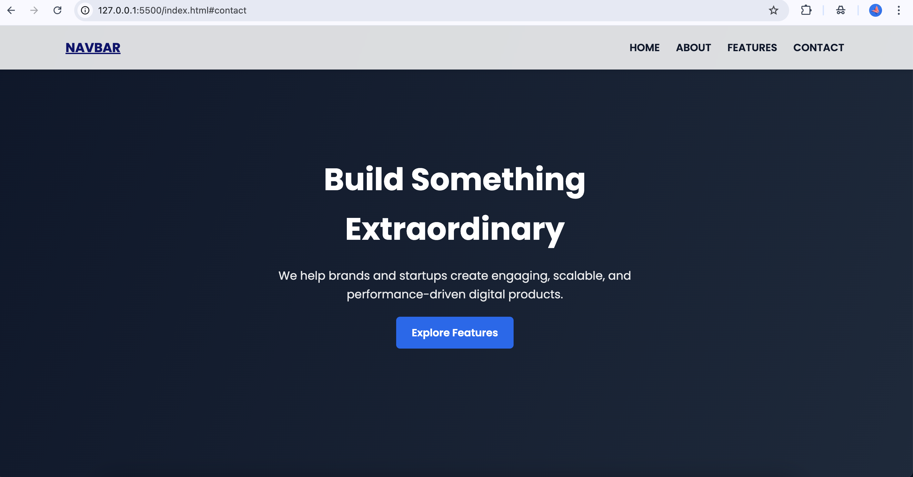
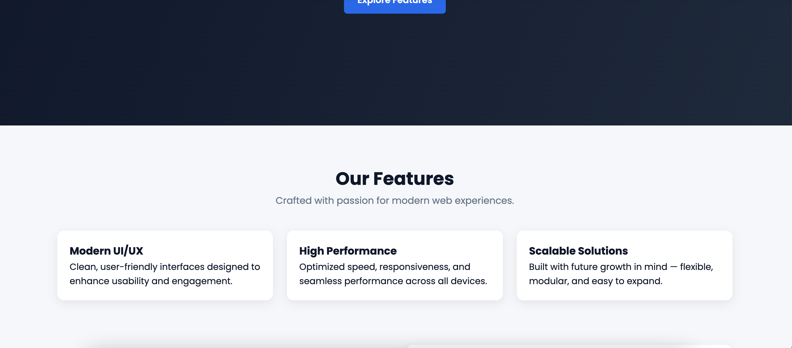
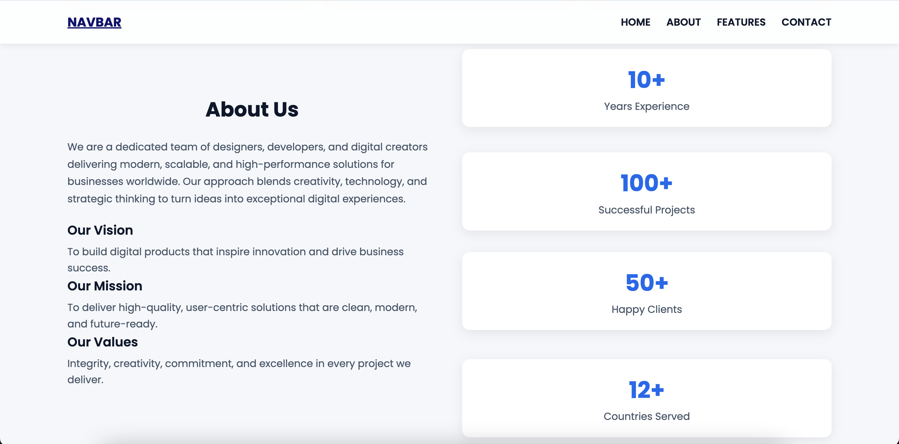
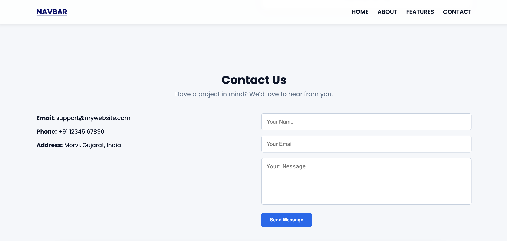

# 🌐 Interactive Navigation Menu — Web Development Project

This project demonstrates a modern, responsive navigation menu that changes its appearance based on user interaction. The menu is fixed at the top of the page, reacts smoothly when the user scrolls, and includes hover effects for better usability and visual appeal.

---

## 📌 Project Overview

The goal of this project was to build an **interactive navigation bar** using **HTML, CSS, and JavaScript**.  
The navbar includes:

- A **fixed position** so it remains visible on all pages.
- A **scroll effect**, where the background color changes when the user scrolls.
- **Hover animations** for menu items.
- A **responsive design** with a mobile-friendly toggle menu.
- A **clean, modern UI** with professional color themes.

This project focuses on improving front-end UI/UX, interactivity, and responsiveness.

---

## 🛠️ Technologies Used

- **HTML5** – Structure of the webpage
- **CSS3** – Styling, layout, responsiveness, hover animations
- **JavaScript (ES6+)** – Scroll detection & interactive menu toggle

---

## ✨ Features

- 🔒 **Fixed Navbar** — Always stays visible
- 🎨 **Color Change on Scroll** — Smooth transition as you scroll down
- 🖱️ **Hover Effects** — Menu items animate for better user experience
- 📱 **Responsive Mobile Navigation** — Hamburger toggle included
- ⚡ **Modern UI Design** — Clean, professional, gradient theme

---

## 📸 Screenshots

  

  

